# SXE01

## Tabla
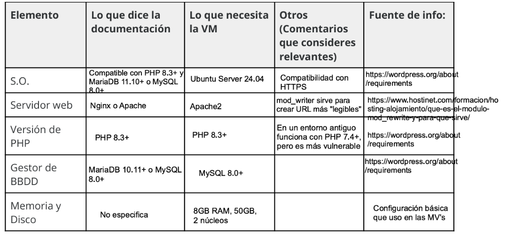

## Máquina Virtual
Así queda la primera parte de la máquina virtual. Además, como puse en la tabla, le puse 8192MB de RAM, 2 núcleos y 50GB de disco aunque no se muestra en las imágenes.

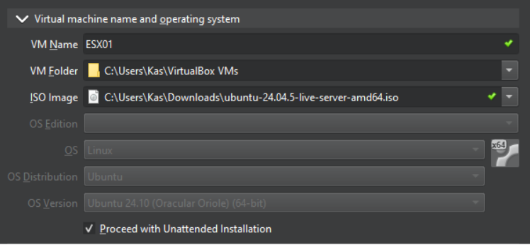

## Instalación Ubuntu Server
En esta parte solo muestro la creación del perfil y como marcamos la opción de OpenSSH para realizar las tareas posteriores.

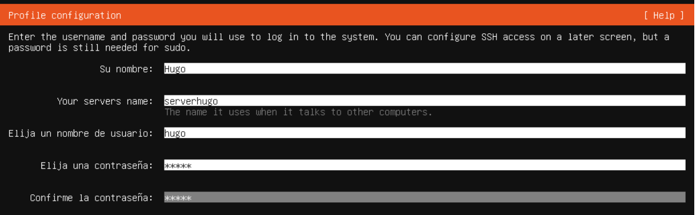

## Conexión a la MV desde el anfitrión
Primero no era capaz de conectarlo así que, le puse un adaptador puente a la MV, pero no me daba IP. Tuve que modificar el .yaml y añadir la interfaz para recibirla. Una vez hecho esto, me conecté
con el comando de ssh nombre_usuario@IP_adaptador.

## Actualización de la información de paquetes e instalación de Apache, MySQL y PHP
La primera parte es simplemente actualizar la información que tiene Ubuntu de los paquetes usando sudo apt update y la segunda es un comando más largo que instala Apache, MySQL y PHP junto con varias extensiones necesarias para WordPress en Ubuntu Server. Algunos de estas extensiones son para trabajar con ZIPs, XML, permitir que PHP se conecto a MySQL...

## Descarga y descompresión de WordPress
Con el primer comando de la imagen, estamos creando la carpeta /srv/www, en la que se descargarán los archivos de WordPress. La opción -p hace que se creen también las carpetas superiores que hagan falta y no de error si ya existen.

El segundo comando hace que el propietario de la carpeta pase a ser www-data, que es un usuario que utiliza normalmente Apache, para que el servidor web pueda leer y trabajar con los archivos de WordPress.

Por último, el comando anterior al pipe descarga desde la web de WordPress el archivo latest.tar.gz, que es el archivo comprimido que contiene la última versión de WordPress. El comando posterior, sirve para extraer los archivos en la carpeta utilizando el usuario www-data.

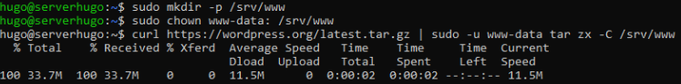

## Configuración Apache
Editamos el archivo de la imagen para hacer lo siguiente:
- Virtual Host *:80: Crea un Virtual Host de Apache que escucha las peticiones HTTP que lleguen al puerto 80.
  
- DocumentRoot /srv/www/wordpress: Es la carpeta donde están los archivos de WordPress.
  
- Directory /srv/www/wordpress: Indica que las opciones a continuación se apliquen a esa carpeta.
  
- Options FollowSymLinks: Permite que Apache siga enlaces simbólicos.
  
- AllowOverride Limit Options FileInfo: Indica que tipos de configuración se pueden modificar. En este caso son reglas relacionadas con el acceso, determinadas opciones de Apache y configuraciones relacionadas con archivos y peticiones.
  
- DirectoryIndex index.php: Indica el archivo que debe buscar Apache por defecto, en este caso index.php.
  
- Require all granted: Permite el acceso a todos los usuarios a esta carpeta.
  
- Directory /srv/www/wordpress/wp-content: Configuración específica para la carpeta /srv/www/wordpress/wp-content.
  
- Options FollowSymLinks: Permite que Apache siga enlaces simbólicos dentro de wp-content.
  
- Require all granted: Permite el acceso a todos los usuarios a esta carpeta de wp-content.

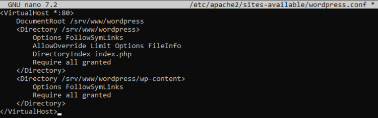

## Configuración y activación de Apache para Wordpress
El primer comando de la imagen activa el módulo rewrite de Apache, lo que permite reescribir las URL. Wordpress lo utiliza para que funcionen las URLs amigables.

El segundo comando deshabilita el sitio web predeterminado por Apache llamado 000-default. Hacemos esto porque antes ya creamos la configuración nuestra al modificar el archivo anterior mediante nano.

El último hace que Apache cargue esta nueva configuración sin reiniciar al 100% el servicio.

## Operaciones en MySQL
El comando permite entrar en la consola de MySQL usando el usuario root. Una vez dentro, creamos la base de datos llamada wordpress.

Seguimos con la creación de un usuario. En este caso, el usuario se llama wordpress, que solo puede conectarse desde el servidor y con una contraseña que es aeiou.

El comando posterior a la creación del usuario hace que este tenga diferentes permisos, como consultar, insertar y modificar datos, así como crear, eliminar y modificar estructura de las tablas. 

En esta parte, tuve problemas. En la guía la parte de 'wordpress'@'localhost' aparecía sin esas comillas y me daba error. Busqué porque era y es porque MySQL sin las comillas no lo interpreta como String, entonces no reconoce el nombre del usuario ni desde donde se puede conectar, pero al poner las comillas esto cambia y funciona.

Por último, 'FLUSH PRIVILEGES;' hace que MySQL recargue los privilegios de los usuarios para aplicar los cambios que acabamos de asignar al usuario wordpress.

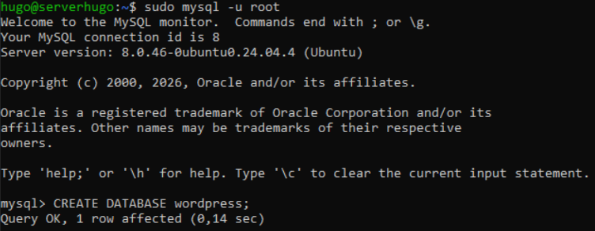
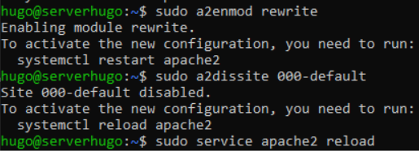

## Configuración de las credenciales de WordPress
La sintaxis del comando es la siguiente:
- sudo -u www-data: Ejecuta el comando utilizando el usuario www-data.
  
- sed: Permite buscar y modificar texto dentro de archivos.
  
- -i: Hace que el cambio se realice directamente en el archivo.
  
- 's/database_name_here/wordpress/': Indica qué texto debe buscar y por cuál debe sustituirlo. s significa sustituir, database_name_here es el texto que busca y wordpress el texto por el que lo sustituye. Por lo tanto, lo que hacemos es establecer que el nombre de la base de datos es wordpress.
  
- /srv/www/wordpress/wp-config.php: Es el archivo que se modifica.

Los otros dos comandos hacen lo mismo que este, solo que con uno establecemos el nombre de usuario y con el otro la contraseña de ese usuario.

## Creación del archivo de configuración de WordPress
Este comando copia el archivo de configuración de ejemplo dado por WordPress que es el wp-config-sample.php y crea a partir de él el archivo wp-config-php. Este archivo será el que usemos para la configuración de las claves de seguridad de WordPress.

## Configuración de las claves de seguridad
Primero de todo, eliminamos las líneas define porque son valores de ejemplo. Por lo tanto, debemos sustituirlas por las claves únicas generadas por WordPress. Para ello, tenemos que ir a la página de WordPress y generlas las keys. Cuando las tengamos, las pegamos donde se encontraban las de prueba.

Las claves se utilizan para mejorar la seguridad de WordPress, especialmente para proteger las sesiones, las cookies de id y los datos utilizados para verificar acciones de los usuarios.

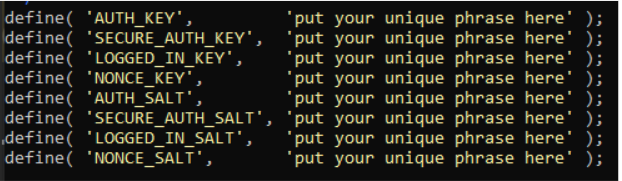
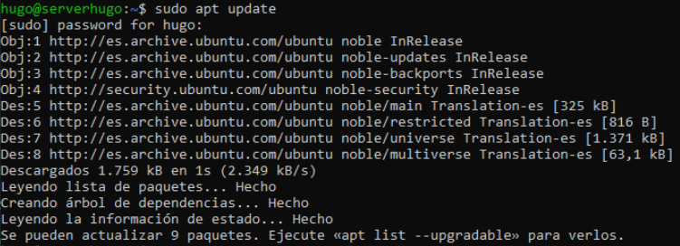
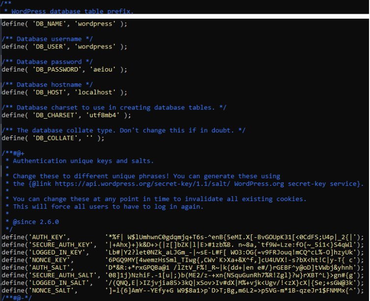

## Acceso a WordPress
El último paso es abrir el navegador y escribir http://192.168.1.143/, que hace referencia a la MV de Ubuntu. Al entrar, comprobamos que aparece la página de WordPress, por lo que ya habríamos completado todos los pasos.

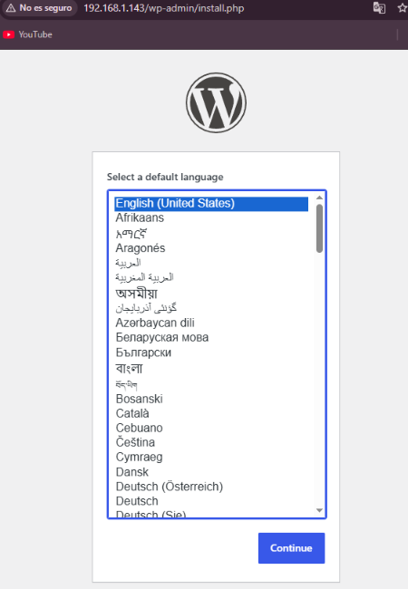

  

